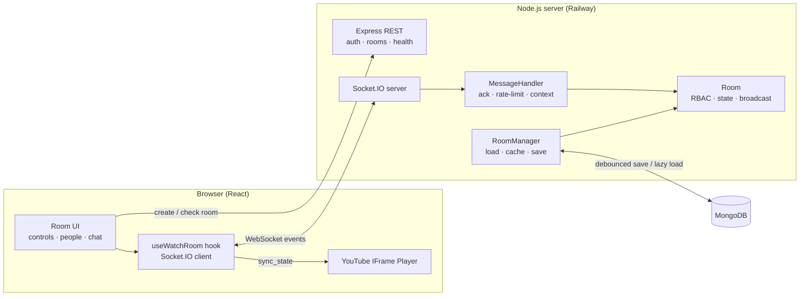

# WatchParty — Watch YouTube Together, in Sync

A real-time **YouTube Watch Party**: everyone in a room sees the same video at the same moment. When the host plays, pauses, seeks or changes the video, every participant follows instantly over **WebSockets**.

### 🔗 Live app: **https://youtube-watch-party-production-8589.up.railway.app/**

Deployed on **Railway** as a single service: Express serves the REST API, the Socket.IO WebSocket server and the built React app from the same URL.

| Layer     | Technology                                                    |
| --------- | ------------------------------------------------------------- |
| Frontend  | **React 18** + Vite + React Router                            |
| Backend   | **Node.js** + **Express 5**                                   |
| Real-time | **WebSockets** via **Socket.IO 4**                            |
| Database  | **MongoDB** (Mongoose): users, rooms, members, roles, chat    |
| Auth      | Email + password, **scrypt** hashing, **JWT** (jsonwebtoken)  |
| Video     | **YouTube IFrame Player API**                                 |
| Hosting   | **Railway** (one service: API + WebSocket + React build)      |

**Try it:** open the live link, sign up, create a room, then open the invite link in a second browser (or an incognito window) with another account. Rooms created without a link start with the default video [`U0EI7XFkkV4`](https://www.youtube.com/watch?v=U0EI7XFkkV4).

---

## ✅ Assignment checklist

How each requirement of the brief is met:

| Requirement | Where / how |
| --- | --- |
| **Real-time sync** of play/pause, seek position and current video | Server-authoritative `PlaybackState`; every change is broadcast as `sync_state`; clients correct clock offset and drift (see [Sync](#how-sync-stays-accurate)) |
| **Room-based model** with unique links/codes | 6-character room codes; `/room/:code` invite links; one-click copy in the room header |
| **YouTube integration** | YouTube IFrame Player API, controlled only through our server; accepts `watch?v=`, `youtu.be`, `shorts`, `embed`, `live` links or an 11-char id |
| **WebSockets** | Socket.IO over a real WebSocket transport (long-polling only as a fallback) |
| **Role-based access**: host assigns roles | Host, Moderator, Participant, Viewer, enforced on the server for every event |
| Creator becomes **Host**; joiners are **Participant** by default | `RoomManager.createRoom` / `Room.join` |
| Host can **assign roles** (Participant → Moderator) | `assign_role` → `role_assigned` broadcast |
| Host can **remove participants** | `remove_participant` → `participant_removed`; the removed user can't rejoin |
| Host can **transfer host** | `transfer_host` → `host_transferred` (also automatic if the host leaves) |
| Playback controls restricted to **Host and Moderator** | `authorize(actor, CONTROL_PLAYBACK / CHANGE_VIDEO)` in `Room`; others get `FORBIDDEN` |
| **Participant must request approval** for changes | `request_change` → queued → Host/Moderator `resolve_request` approves or declines |
| **Backend validates permissions** before processing | `backend/src/core/permissions.js` + `Room` methods; the UI also disables restricted controls |
| **Role updates broadcast** so the UI can show roles | `role_assigned`, `host_transferred`, `participants_update` |
| Participant list with roles | People tab: roles, online/reconnecting status, host management menu |
| Basic chat (bonus) | Room chat with history |
| **Deployed publicly** | Railway, see [Deployment](#-deployment-railway) |
| README with setup, run instructions and live URL | This file |
| Architecture overview | [Architecture](#-architecture) below + [`docs/ARCHITECTURE.md`](docs/ARCHITECTURE.md) |

### Bonus ideas implemented

- ✅ **OOP WebSocket server**: `Room`, `Participant`, `PlaybackState`, `RoomManager` and `MessageHandler` classes
- ✅ **Persistent rooms** in MongoDB (state, members, roles, chat). They survive restarts and expire after 7 days idle (TTL index)
- ✅ **Authentication**: only logged-in users can create or join rooms (checked on `POST /api/rooms` and on the `join_room` WebSocket event). Your seat and role follow you to any device
- ✅ **Text chat** with history
- ✅ **Emoji reactions** floating over the video for everyone
- ✅ **Transfer host**, plus automatic host hand-over if the host leaves
- ✅ **Reconnect-safe identity**: refresh the page and you keep your seat and role
- ✅ **Scalability notes**: see [Design decisions](#-design-decisions--trade-offs)

### Extras

- **Live sync meter**: every player shows how many milliseconds it is from the room's position, and the header shows the round-trip latency to the server.
- **Tight sync**: players re-sync as soon as playback starts after buffering (late joiners land within ~150 ms) and paused players snap to the exact frame.
- **Easy invites**: one-click copy of the room code or the invite link.
- **Video previews**: thumbnails while pasting links, on change-video requests and in "Now playing".
- **Theater mode**, double-click for fullscreen, "Jump back in" list of recent rooms.
- Fully responsive; respects `prefers-reduced-motion`.

---

## 🏗️ Architecture



### How WebSockets drive the flow

1. **Login.** `POST /api/auth/login` returns a **JWT**. The client sends it as `Authorization: Bearer …` on REST calls and in the Socket.IO handshake (`auth: { token }`), where an `io.use()` middleware verifies it.
2. **Create.** `POST /api/rooms` creates the room and returns a secret **session token** that identifies the creator as Host.
3. **Join.** The client opens a WebSocket and sends `join_room { roomId, token }`; the username comes from the verified account. The server replies with the full room state in the acknowledgement and broadcasts `user_joined` to the room.
4. **Control.** A Host/Moderator emits `play` / `pause` / `seek` / `change_video`. The server **checks the role**, updates the authoritative `PlaybackState`, and broadcasts `sync_state` to everyone, including the sender.
5. **Apply.** Every client applies `sync_state` to its YouTube player. There is exactly **one source of truth: the server**.
6. **Requests.** A Participant emits `request_change`; hosts and moderators receive `requests_update`; `resolve_request` approves (→ `sync_state`) or declines, and the requester gets `request_resolved`.

### How sync stays accurate

- The server stores `{ videoId, isPlaying, position, updatedAt }` rather than a ticking clock. While playing, the live position is `position + (now − updatedAt)`.
- Each `sync_state` carries `serverTime`. Clients measure their **clock offset** to the server (NTP-style `time_sync` ping, best of 4) and compute where the video *should* be right now: `currentTime + (clientNow + offset − serverTime)`.
- After every event the player corrects itself if it is more than **0.4 s** off. When playback actually starts after buffering it re-checks once more, and a background **drift check every second** re-syncs anyone more than **1.2 s** off. Paused players snap to within **0.1 s**.
- The YouTube iframe has `controls: 0` and a transparent shield on top, so nobody can change playback locally; every change goes through the server.

### WebSocket events

| Event                                     | Direction       | Payload                                               | Who                     |
| ----------------------------------------- | --------------- | ----------------------------------------------------- | ----------------------- |
| `join_room`                               | Client → Server | `{ roomId, token? }` → ack `{ token, state }`         | logged-in users         |
| `leave_room`                              | Client → Server | `{}`                                                  | anyone                  |
| `play` / `pause`                          | Client → Server | `{}`                                                  | Host, Moderator         |
| `seek`                                    | Client → Server | `{ time }`                                            | Host, Moderator         |
| `change_video`                            | Client → Server | `{ videoId }` or `{ url }`                            | Host, Moderator         |
| `request_change`                          | Client → Server | `{ type, payload }`                                   | Participant             |
| `resolve_request`                         | Client → Server | `{ requestId, approve }`                              | Host, Moderator         |
| `cancel_request`                          | Client → Server | `{ requestId }`                                       | request owner           |
| `assign_role`                             | Client → Server | `{ userId, role }`                                    | Host                    |
| `remove_participant`                      | Client → Server | `{ userId }`                                          | Host                    |
| `transfer_host`                           | Client → Server | `{ userId }`                                          | Host                    |
| `chat_message` / `reaction`               | Client → Server | `{ text }` / `{ emoji }`                              | everyone                |
| `time_sync`                               | Client → Server | → ack `{ serverTime }`                                | anyone                  |
| `sync_state`                              | Server → Room   | `{ videoId, playState, currentTime, serverTime, action }` |                     |
| `user_joined` / `user_left`               | Server → Room   | `{ userId, username, role?, participants }`           |                         |
| `role_assigned`                           | Server → Room   | `{ userId, username, role, assignedBy, participants }` |                        |
| `participant_removed`                     | Server → Room   | `{ userId, username, removedBy, participants }`       |                         |
| `host_transferred`                        | Server → Room   | `{ from, to, reason, participants }`                  |                         |
| `participants_update`                     | Server → Room   | `{ participants }` (online/offline changes)           |                         |
| `requests_update`                         | Server → User   | `{ requests }` (all for hosts/mods, own for others)   |                         |
| `request_resolved`                        | Server → User   | `{ requestId, type, approved, resolvedBy }`           |                         |
| `removed_from_room`                       | Server → User   | `{ by }`                                              |                         |
| `chat_message` / `reaction`               | Server → Room   | message / reaction                                    |                         |

Every client → server event uses a Socket.IO **acknowledgement**: the server always replies `{ ok: true, ... }` or `{ ok: false, error: { code, message } }`, e.g. `FORBIDDEN` when a Participant tries to `play`.

### REST endpoints

| Method & path            | Purpose                                            |
| ------------------------ | -------------------------------------------------- |
| `POST /api/auth/signup`  | `{ name, email, password }` → `{ token, user }`    |
| `POST /api/auth/login`   | `{ email, password }` → `{ token, user }`          |
| `GET /api/auth/me`       | Validate a JWT → `{ user }`                        |
| `POST /api/rooms`        | **Login required.** `{ roomName, videoUrl? }` → `{ roomId, token }` |
| `GET /api/rooms/:roomId` | Room summary (used by the join form / invite link) |
| `GET /api/health`        | Health check: storage type, live rooms, uptime (Railway uses it) |

More detail: [`docs/ARCHITECTURE.md`](docs/ARCHITECTURE.md).

---

## 🧰 How each library is used

| Library / tool | Where | What it does here |
| --- | --- | --- |
| **React** | `frontend/src` | UI as components; `useWatchRoom` turns socket events into React state |
| **Vite** | `frontend/` | Dev server with hot reload; production build into `frontend/dist`. In dev it proxies `/api` and `/socket.io` to the Node server |
| **React Router** | `frontend/src/main.jsx` | `/` (create/join) and `/room/:roomId` (invite links) |
| **socket.io-client** | `frontend/src/lib/socket.js` | Opens the WebSocket, sends the JWT in the handshake, auto-reconnects, `emitWithAck` for request/response |
| **YouTube IFrame API** | `frontend/src/components/YouTubePlayer.jsx` | Embeds the player and applies `sync_state` (`loadVideoById`, `seekTo`, `playVideo`, `pauseVideo`) |
| **Express 5** | `backend/src/app.js`, `routes/` | REST API and serves the built React app |
| **Socket.IO** | `backend/src/app.js`, `socket/MessageHandler.js` | WebSocket server; Socket.IO rooms (`io.to(roomId)`) for broadcasting; acknowledgements for every event |
| **Mongoose / MongoDB** | `backend/src/db/` | Users and rooms (state, members, roles, chat); TTL index expires idle rooms |
| **jsonwebtoken** | `backend/src/auth/` | Signs and verifies login tokens (REST + WebSocket handshake) |
| **node:crypto** | `backend/src/auth/` | `scrypt` password hashing, random session tokens (only hashes are stored) |
| **dotenv / cors** | `backend/src/config.js`, `app.js` | Reads `backend/.env`; CORS only when the frontend is on another domain |

---

## 📁 Project structure

```
.
├── frontend/                   # React + Vite frontend
│   └── src/
│       ├── pages/              # Home (create/join), Room
│       ├── components/         # YouTubePlayer, PlaybackControls, ParticipantList, RequestsPanel,
│       │                       # Chat, Reactions, VideoForm, ShareMenu, AuthModal, Toasts, Icons
│       ├── hooks/useWatchRoom.js   # all Socket.IO logic → React state
│       └── lib/                # socket, api, auth, youtube helpers, storage
├── backend/                    # Node.js + Express + Socket.IO backend
│   └── src/
│       ├── core/               # Room, Participant, PlaybackState, RoomManager, permissions
│       ├── socket/MessageHandler.js
│       ├── auth/               # signup/login, JWT, password hashing
│       ├── db/                 # Mongoose models + repositories (MongoDB / in-memory)
│       ├── routes/             # REST endpoints
│       ├── app.js              # wires Express + Socket.IO
│       └── index.js            # entry point, graceful shutdown
├── docs/ARCHITECTURE.md        # architecture + code-walkthrough notes
└── railway.json                # Railway build/deploy settings
```

---

## 🚀 Run locally

**Prerequisites:** Node.js ≥ 20. MongoDB is optional: local, Docker, Atlas, or none (in-memory).

```bash
# 1. Install dependencies (root, backend and frontend)
npm install
npm run install:all

# 2. Configure the server
cp backend/.env.example backend/.env     # set MONGODB_URI, or leave it empty for in-memory storage

# 3. Start backend (http://localhost:4000) + frontend (http://localhost:5173) with hot reload
npm run dev
```

Open **http://localhost:5173**, sign up, create a room, and open the invite link in another browser (or an incognito window) to join as a second user.

> No MongoDB handy? `docker run -d -p 27017:27017 mongo:7`, or leave `MONGODB_URI` empty to use in-memory storage (data is lost on restart).

**Production mode locally** (exactly what Railway runs):

```bash
npm run build     # installs everything and builds the React app into frontend/dist
npm start         # Express serves the API, the WebSocket server and the React build on :4000
```

### Environment variables (`backend/.env`)

| Variable             | Default                | Purpose                                                               |
| -------------------- | ---------------------- | --------------------------------------------------------------------- |
| `PORT`               | `4000`                 | HTTP + WebSocket port (Railway sets it automatically)                 |
| `NODE_ENV`           | `development`          | Set to `production` in the cloud                                      |
| `MONGODB_URI`        | _(empty → in-memory)_  | MongoDB connection string                                             |
| `JWT_SECRET`         | _(random in dev)_      | Secret for signing login tokens. **Required in production**           |
| `CLIENT_ORIGIN`      | _(empty)_              | Only if the frontend is on another domain (enables CORS for it)       |
| `RECONNECT_GRACE_MS` | `15000`                | How long a disconnected user keeps their seat/role                    |
| `VITE_SERVER_URL`    | _(empty)_              | **Client** build var: backend URL if the frontend is hosted separately |

---

## ☁️ Deployment (Railway)

The app runs as **one Railway service**: same origin for the page, the API and the WebSocket, so there's no CORS setup, and Railway's proxy supports WebSockets out of the box. Build and start settings live in [`railway.json`](railway.json):

| Setting | Value |
| --- | --- |
| Build command | `npm run build` (installs backend + frontend deps, builds React into `frontend/dist`) |
| Start command | `npm start` (runs `backend/src/index.js`) |
| Health check | `GET /api/health`: a new deploy only receives traffic once this returns 200 |
| Restart policy | On failure, up to 5 retries |

**Steps**

1. Push the repo to GitHub.
2. **Railway → New Project → Deploy from GitHub repo** → pick this repo. Railway reads `railway.json` and injects `PORT`.
3. Add a database: **+ New → Database → MongoDB** (or use a free MongoDB Atlas cluster).
4. In the web service → **Variables**, add:
   - `NODE_ENV` = `production`
   - `JWT_SECRET` = a long random string (`node -e "console.log(require('crypto').randomBytes(32).toString('hex'))"`)
   - `MONGODB_URI` = `${{MongoDB.MONGO_URL}}` (a reference to Railway's MongoDB service) or your Atlas URI
5. **Settings → Networking → Generate Domain** to get the public URL.
6. Check `https://<your-domain>/api/health`. It should report `"storage": "mongodb"`. If it says `"memory"`, `MONGODB_URI` isn't set and data won't survive a redeploy.

**Deployment notes**

- Railway sends `SIGTERM` on every redeploy; the server flushes all unsaved room state to MongoDB before exiting (`backend/src/index.js`).
- `app.set('trust proxy', 1)` so per-IP rate limits see the real client IP behind Railway's proxy.
- In production the server refuses to start without `JWT_SECRET`, and exits if `MONGODB_URI` is set but MongoDB is unreachable. It fails loudly instead of silently losing data.
- **Split hosting** (e.g. Netlify frontend + Railway backend) also works: build the client with `VITE_SERVER_URL=https://<backend>` and set `CLIENT_ORIGIN=https://<frontend>` on the backend.

---

## ⚖️ Design decisions & trade-offs

- **Server is the single source of truth.** Clients never trust each other's players; they only apply `sync_state`. This keeps role enforcement simple and prevents "echo loops" where two players keep correcting each other.
- **Custom controls instead of YouTube's.** The native YouTube UI can't be permission-checked, so it's hidden and blocked; our control bar goes through the server, or becomes a *request* for Participants.
- **Participant vs Viewer.** The brief allows Viewer as an alias for Participant. Here, Participants can *request* changes (the approval flow), while Viewers are strictly watch-only, so the host can choose either.
- **Autoplay policy.** Browsers block autoplay with sound until the user interacts, so each viewer clicks once ("Join playback") and then stays in sync automatically.
- **Login required.** Every room member is a registered account (JWT verified on REST and in the WebSocket handshake), so a removed user can't rejoin under a new name. A per-room session token (only its SHA-256 hash is stored) restores the exact seat after a refresh. Passwords are hashed with **scrypt**. The JWT is kept in `localStorage` for simplicity; an httpOnly cookie would be more XSS-resistant.
- **Debounced persistence.** State changes are saved to MongoDB at most every ~0.75 s per room, so a burst of seeks costs one write. Pending approval requests are intentionally in-memory only.
- **Reconnect grace period.** A refresh or network blip doesn't kick you out or trigger a host hand-over; you're shown as *reconnecting* for 15 s.
- **Scaling beyond one instance.** Live room state is held in memory by the instance that owns the room, so this deployment runs a single Railway instance, which comfortably handles hundreds of concurrent sockets for this workload. To reach the brief's 1,000+ users / 100+ rooms target across several instances, you'd add the **Socket.IO Redis adapter** for cross-instance broadcasts, plus room affinity (route every member of a room to the same instance, e.g. hashing on `roomId`) or move `PlaybackState` into Redis.
